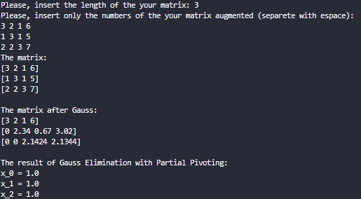
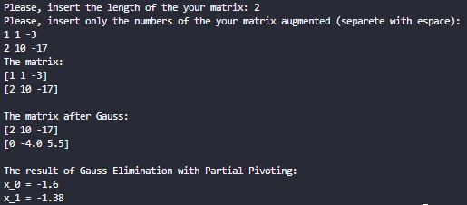

# Implementation of Gauss Elimination with Partial Pivoting
This implementaion is a Gauss Elimination with Partial Pivoting in Python. You can insert a number of lines of your augmented matrix and then, the numbers that compose it.

# Screenshot
Those are some examples:

# Author
[GiovannaRMendes](https://github.com/GiovannaRMendes)