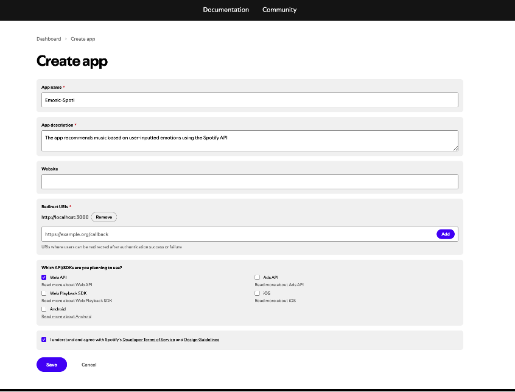

# Music Recommendation Based on Emotion

A Python script that recommends music playlists based on user-inputted emotions using the Spotify API. The script fetches songs that match the user's mood and provides a playlist with links to each song.

## Features

- Recommend songs based on various emotions.
- Integrates with Spotify's Web API to fetch song recommendations.

## Setup

### 1. Set Up Spotify API

To use this script, you will need to create a Spotify Developer account and register an app to obtain your Client ID and Client Secret. Follow the instructions [here](https://developer.spotify.com/documentation/general/guides/authorization/app-settings/) to get your credentials.

Here is an example:



### 2. Install Required Libraries

Make sure you have the following Python libraries installed:

    ```bash
    pip install spotipy
    pip install requests
    ```


### 3. Run the Script

**Notes:**
- Replace **your_spotify_client_id** and **your_spotify_client_secret** in the script with your actual Spotify API credentials.
- You can extend the emotion_to_genre dictionary with more emotions and genres.
- You can modify the limit=10 in the Spotify recommendations query to change the number of recommended songs.

To run the script, use the following command:

    ```bash
    python Emosic-Spoti.py
    ```

**Usage**

After running the script, enter an emotion from the list below to get a music playlist:

- happy
- sad
- angry
- relaxed
- energetic
- anxious
- cheerful
- stressed
- dreamy
- excited
- bored
- nostalgic
- hopeful
- content
- romantic

  Type 'exit' to quit the program.

If the Emotion you enter is NOT in the list, so we will show **pop** music instead.

**How It Works**

- **Authentication**: The script uses the SpotifyClientCredentials class to handle authentication with the Spotify API.
- **Emotion-to-Genre Mapping**: The script maps emotions to corresponding music genres using a predefined dictionary.
- **Track Recommendations**: The script queries the Spotify API to fetch song recommendations based on the selected genre.
- **User Input**: The user inputs their emotion, and the script fetches and displays a playlist of matching songs.